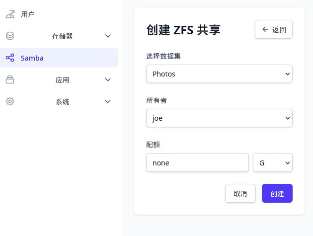

# How to Create a Hard Drive Mirror (RAID 1) to Manage Your Photo Album

RAID1 (mirroring) is a storage solution that achieves data redundancy by writing data to two or more hard drives simultaneously. When one drive fails, the other drive still retains the complete data, thereby ensuring data safety.

## Characteristics of RAID1

- ✅ **Data Safety**: Every piece of data has a complete mirror copy; a single-drive failure will not result in data loss
- ✅ **Improved Read Performance**: Data can be read from multiple drives simultaneously
- ⚠️ **Capacity Halved**: The total usable capacity is 50% of the smallest drive's capacity (with two drives)


## Applicable Scenarios

- Storing important files, photos, videos, and other data that cannot be lost
- Core data storage for home or small office environments
- Scenarios where data security is more important than storage capacity

## Preparation

Before you start creating RAID1, please confirm:

- [ * ] You have at least two drives of the same or similar capacity (same brand and capacity recommended)
- [ * ] **Important**: Creating RAID1 will erase all data on the selected drives. Please back up your data in advance.

!!! warning "Data Safety Warning"
    During the RAID1 creation process, the selected drives will be initialized and partitioned, and all existing data will be cleared. Please make sure to back up important data before proceeding.

## Creation Steps

### 1. Log In to the Web Management Interface

Enter the OneNAS IP address in your browser and log in with an **administrator account**.


| Partition | Purpose |
|------|------|
| sda1 | Boot drive, stores EFI and ZFSBootMenu related files |
| sda2 | System drive, stores Debian-related system data |
| sda3 | Data drive available for user data |
| sdb, sdc | Data drives that can be used to create RAID 1. Note: The information displayed here is simplified. After the ZFS RAID 1 is created, the hard drives will be identified by their **UUID** |

### 2. Partition the Hard Drives


The image above shows the operation buttons in the storage management page. Their meanings are as follows:

| Button | Description |
|------|------|
| **Create Partition** | Create a new partition for the selected hard drive |
| **Clear Label** | Clear the partition label or identification information on the hard drive. If the hard drive was previously used for ZFS, clear the label before removing it; otherwise, the system will still read the ZFS label |
| **Delete** | Delete the selected partition or hard drive (please confirm that data has been backed up before performing this action) |

###  3. Create RAID1

RAID1 can be created on two different hard drives, or on two partitions of two hard drives. Of course, for data safety, it is recommended to create it on two complete hard drives!

Click **Storage Pool** on the left -> **Create**, and the following storage pool creation interface will open:


The image above is an example of creating a RAID1 storage pool. The meanings of each field are as follows:

| Field/Button | Description |
|-----------|------|
| **Data Pool Name** | The name of the storage pool, e.g., `Photos`. It is recommended to use English letters or numbers |
| **Storage Pool Type** | Select `Mirror`, which is the ZFS mirror mode and equivalent to RAID1 |
| **+ Add Disk** | Click to select the hard drives to be added to the mirror |
| **Disk List** | The selected hard drives. In the image, the two disks are `sdb (20G)` and `sdc (20G)` |
| **×** | Remove the corresponding hard drive |
| **Cancel** | Abandon the creation and return to the previous level |
| **Create** | Confirm the configuration and create the RAID1 storage pool |

> **Note**: RAID1 requires at least two hard drives. The image selects `sdb` and `sdc`, two 20G hard drives, to form a mirror. The final usable capacity is the capacity of a single hard drive (approximately 20G).


### 4. Create a ZFS Share

After the RAID1 storage pool is created, you need to create a **ZFS Share** to access the data over the network (such as SMB/Samba). A ZFS share exposes a dataset in the storage pool to users on the local area network, making it convenient to read and write files on Windows, macOS, Linux, and other devices.



The image above is the interface for creating a ZFS share. The meanings of each field are as follows:

| Field/Button | Description |
|-----------|------|
| **Select Dataset** | Select the ZFS dataset to be shared, e.g., `Photos` |
| **Owner** | Set the owner user of the shared dataset. In the image, it is `joe` |
| **Quota** | Limit the maximum space that the share can use. `none` means no limit |
| **G** | Quota unit. Here it is GB (gigabytes) |

After the creation is successful, you can access the share via Samba, for example:

```
\\OneNAS_IP\Photos
```

## Frequently Asked Questions

### Q: How many hard drives does RAID1 require?

A: RAID1 requires at least two hard drives. When using two drives, the usable capacity is the capacity of a single hard drive. When using more hard drives, you still only lose the capacity of one hard drive, but you can get higher read performance.

### Q: What should I do if one hard drive fails?

A: RAID1 allows continued operation when a single drive fails. You need to replace the failed hard drive as soon as possible, and then perform a **Resync** or **Replace** operation on the storage management page. The system will automatically mirror the data to the new hard drive.

### Q: Can RAID1 prevent accidental deletion?

A: No. RAID1 only protects against data loss caused by physical hard drive failure; it cannot prevent accidental deletion. It is recommended to properly manage the **administrator account** and **root** account!

## Follow-up Recommendations

- Regularly check the RAID1 status in the web management interface
- Configure email or notification alerts to stay informed about hard drive failures
- Important data is recommended to be additionally backed up off-site
- Familiarize yourself with the hard drive replacement and rebuild process, just in case
