# 5分钟快速安装 OneNAS

本指南将帮助您在 5 分钟内完成 OneNAS 的基础安装和配置。

## 准备工作

在开始之前，请确保您已准备好以下物品：

- [ * ] OneNAS 设备或一台兼容的计算机
- [ * ] 至少一块硬盘（推荐使用 SSD 作为系统盘, 系统盘至少5G, 推荐60G）
- [ * ] 网线一根 必须是一台有RJ45有线网口的电脑才可安装
- [ * ] 可正常工作的网络环境

## 安装步骤

### 1. 制作启动 U 盘

使用 Rufus 将 OneNAS 系统镜像写入 U 盘：

1. **准备工具**
   - 下载并安装 [Rufus](https://rufus.ie/)（推荐便携版）
   - 准备一个 4GB 或更大容量的 U 盘（数据将被清空，请提前备份）
   - 下载 OneNAS 系统 ISO 镜像文件

2. **写入镜像**
   - 插入 U 盘，打开 Rufus
   - **设备**：选择您的 U 盘
   - **引导类型选择**：点击"选择"按钮，加载 OneNAS ISO 镜像文件

     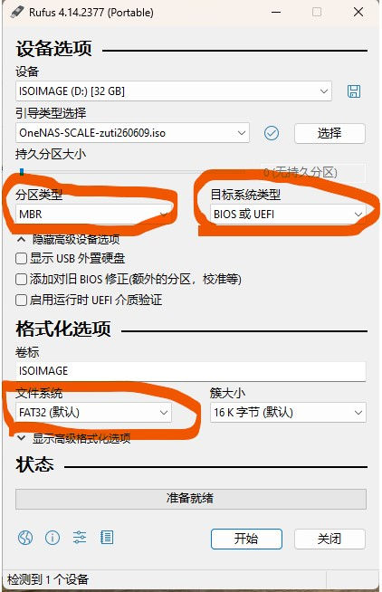

   - **分区类型**：`MBR`
   - **目标系统类型**：`BIOS 或 UEFI`
   - **文件系统**：`FAT32（默认）`
   - 点击**开始**按钮

3. **选择写入模式**
   - 如果弹出"检测到 ISOHybrid 镜像"提示，选择**以 ISO 镜像模式写入（推荐）**

     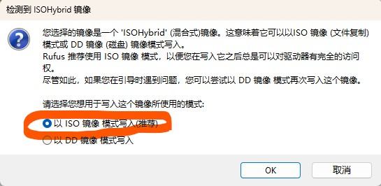

   - 确认格式化警告，等待写入完成

### 2. 从 U 盘启动并安装系统

将制作好的启动 U 盘插入目标设备，开机并选择从 U 盘启动：

1. **GRUB 启动菜单**
   - 开机后您将看到 OneNAS 的 GRUB 启动菜单

     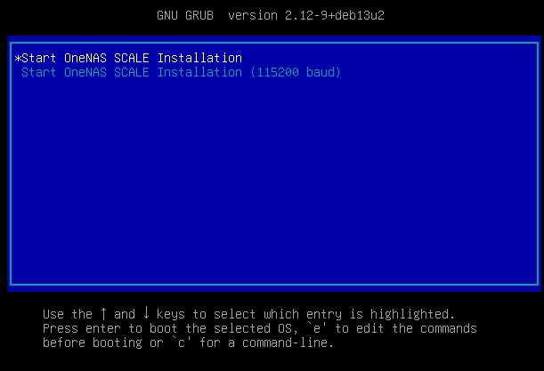

   - 使用上下方向键选择 **Start OneNAS SCALE Installation**，按回车键确认

2. **LiveCD 启动加载**
   - 系统开始将文件系统加载到内存中

     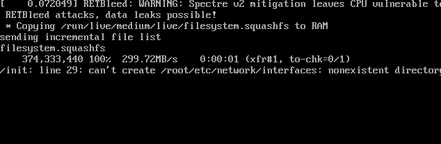
     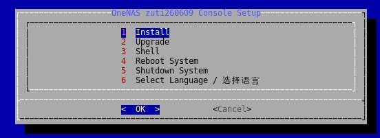

3. **选择安装语言**
   - 加载完成后，首先进入语言选择界面

     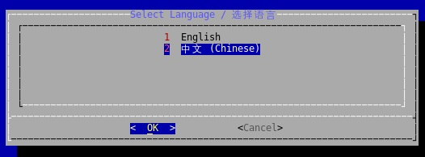

   - 选择 **2 中文 (Chinese)**，按回车键确认

4. **磁盘擦除警告**
   - 系统会列出将要安装到的磁盘，并提示将擦除这些磁盘上的所有分区和数据

     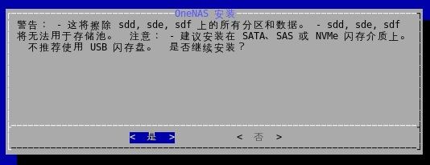

   - **注意**：此操作将清空选定磁盘的所有数据，请确保已备份重要资料
   - 确认无误后选择 **是**，按回车键继续

5. **分区设置**
   - 接下来需要选择系统分区的分配方式

     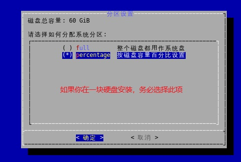

   - **full**：整个磁盘都用作系统盘
   - **percentage**：按磁盘容量百分比设置（推荐，可在同一磁盘上保留空间用于存储池）
   - 如果您只有一块硬盘，**务必选择 percentage**，以便剩余空间创建存储池, 用于文件共享等
   - 选择完成后按回车键确认

6. **Swap 配置**
   - 设置 Swap 交换分区大小

     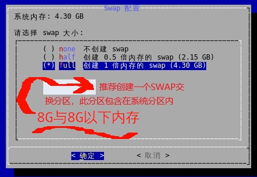

   - **none**：不创建 swap
   - **half**：创建 0.5 倍内存的 swap
   - **full**：创建 1 倍内存的 swap（推荐）
   - 如果系统内存 **8GB和8G以下**，推荐创建 swap 交换分区，此分区包含在系统分区内
   - 选择完成后按回车键确认

7. **设置 Root 密码**
   - 设置系统的 Root 管理员密码

     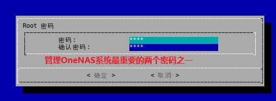

   - Root 密码是管理 OneNAS 系统最重要的密码之一，请务必牢记
   - 输入密码并按回车键，再次输入确认密码

8. **安装成功**
   - 确认无误后继续，系统将开始自动安装
   - 安装过程大约需要 1-3 分钟，请耐心等待
     
   - 重启时请拔出 U 盘，以免再次进入 LiveCD 模式

### 3. 系统首次启动

安装完成后，设备首次启动会进入系统管理配置界面：

1. **启动菜单**
   - 系统启动后会显示启动管理工具菜单
   - 系统允许有多个版本, 按ESC键可选择不同的版本
     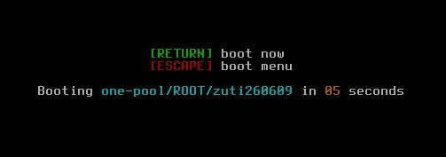

2. **系统配置**

   - 设备启动后，会自动从路由器获取(DHCP) IP 地址。

   - 选择 **Set Manual IP for Network Interface** 可设置静态 IP 地址

     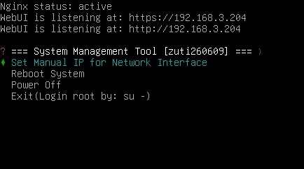

   - 配置完成后即可通过显示的 IP 地址访问 Web 管理界面

### 5. 初始化配置

在浏览器中访问获取到的 IP 地址，开始 Web 端的初始化配置：

1. **处理证书与首次访问**
   - 首次访问时，浏览器可能会提示安全证书不受信任（因为使用了自签名证书）

     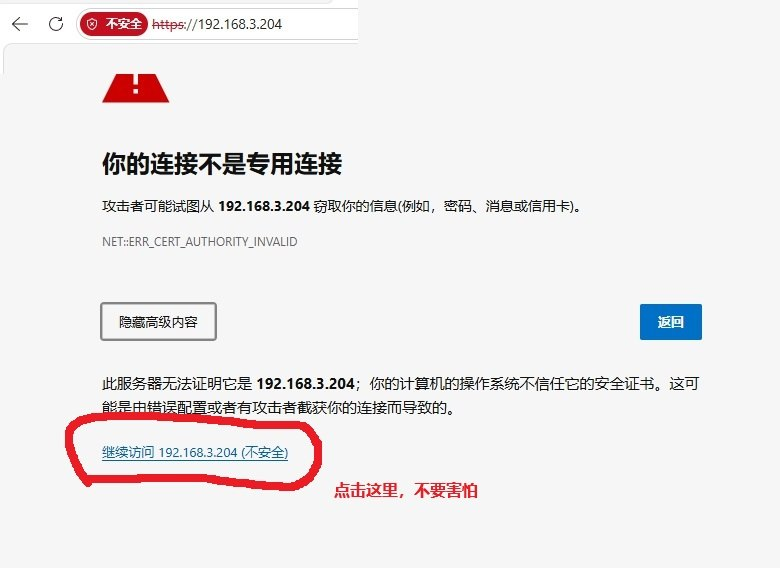

   - 点击**高级**或**继续前往**，选择接受并继续访问

2. **创建管理员账户**
   - 首次访问 Web 界面，系统会要求创建第一个管理员账户

     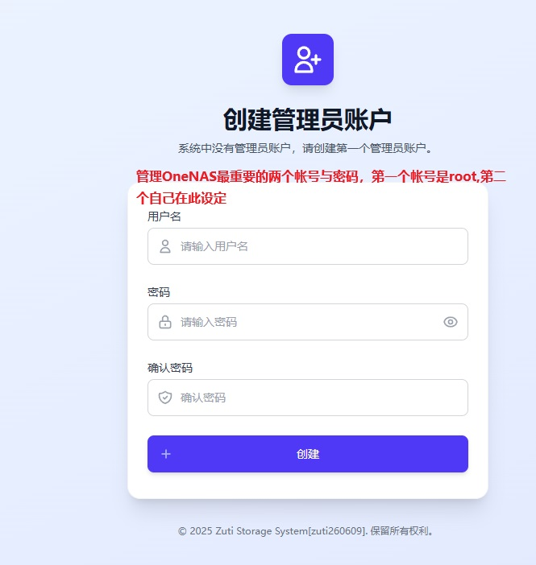

   - **注意**：管理 OneNAS 最重要的两个账号与密码，第一个是 root（在安装时已设置），第二个就是在此设定的管理员账户
   - 输入用户名、密码和确认密码
   - 点击**创建**按钮完成管理员账户创建

3. **登录 Web 管理界面**
   - 使用刚创建的管理员账户登录

     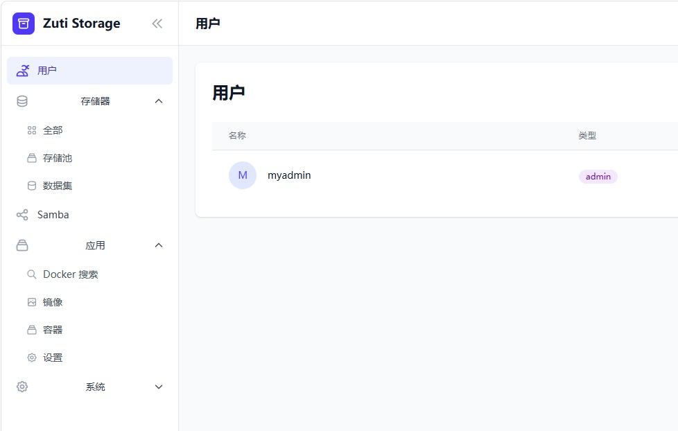

   - 登录后即可看到 OneNAS 的 Web 管理界面，包含用户管理、存储器、Samba、Docker 等功能模块

## 验证安装

安装完成后，您可以：

1. 登录 Web 管理界面，确认各功能模块正常显示
2. 创建一个测试共享文件夹
3. 从电脑访问 `\\192.268.3.204\共享文件夹名`

### 忘记 Root 密码？

- 可通过 LiveCD 重新启动并选择修复模式重置密码
- 或参考官方文档中的密码恢复指南
