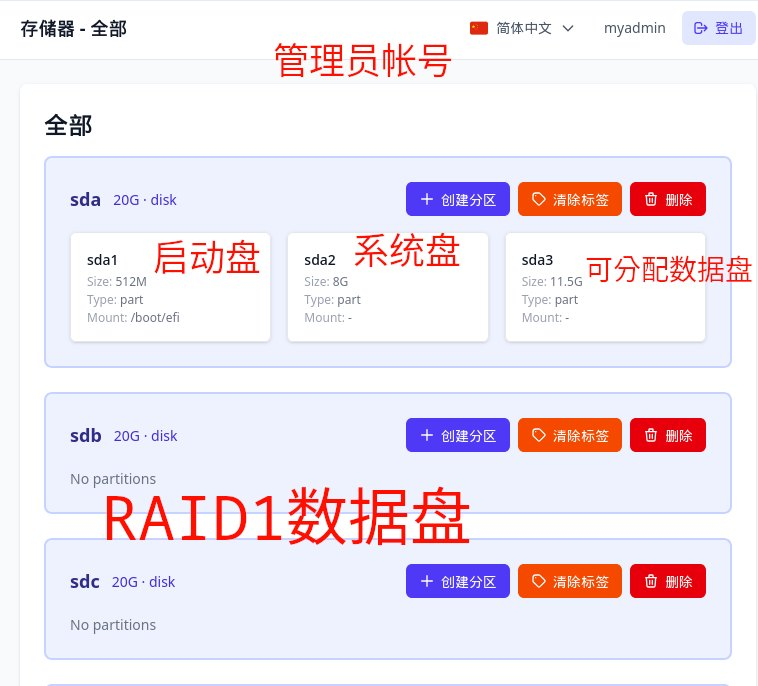
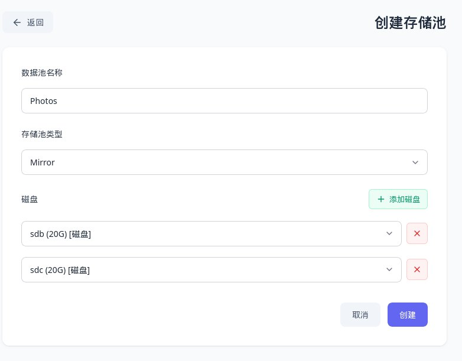
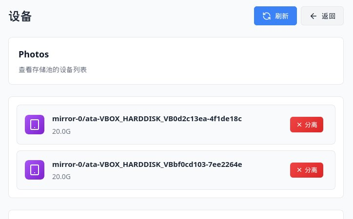

# 如何创建硬盘镜像(RAID 1)管理你的相册

RAID1（镜像）是一种通过将数据同时写入两块或多块硬盘来实现数据冗余的存储方案。当其中一块硬盘发生故障时，另一块硬盘仍保留完整数据，从而保障数据安全。

## RAID1 的特点

- ✅ **数据安全**：每份数据都有完整的镜像副本，单盘故障不会丢失数据
- ✅ **读取性能提升**：可同时从多块硬盘读取数据
- ⚠️ **容量减半**：总可用容量为最小硬盘容量的 50%（两块硬盘时）

## 适用场景

- 存放重要文件、照片、视频等不容丢失的数据
- 家庭或小型办公室的核心数据存储
- 对数据安全性要求高于存储容量的场景

## 准备工作

在开始创建 RAID1 之前，请确认：

- [ * ] 至少有两块容量相同或相近的硬盘（建议同品牌、同容量）
- [ * ] **重要**：创建 RAID1 会擦除所选硬盘上的所有数据，请提前备份

!!! warning "数据安全警告"
    创建 RAID1 的过程中，所选硬盘将被初始化和分区，所有现有数据都会被清除。请务必在操作前备份重要资料。

## 创建步骤

### 1. 登录 Web 管理界面

在浏览器中输入 OneNAS 的 IP 地址，使用**管理员账户**登录。

| 分区 | 用途 |
|------|------|
| sda1 | 启动盘，存 EFI 与 ZFSBootMenu 相关文件 |
| sda2 | 系统盘，基于 Debian 相关的系统数据 |
| sda3 | 可用存用户数据的数据盘 |
| sdb, sdc | 可用于创建RAID 1的数据盘, 注意: 这里给用户显示的是简化的信息, ZFS RAID 1 创建后,会使用硬盘的**UUID** |

### 2. 对硬盘进行分区

上图为存储管理页面中的操作按钮，各按钮含义如下：

| 按钮 | 说明 |
|------|------|
| **创建分区** | 为选中的硬盘创建新分区 |
| **清除标签** | 清除硬盘上的分区标签或标识信息, 如果硬盘原用于ZFS创建过, 删除硬盘前, 先清除标签, 否则, 系统还会读到ZFS标签 |
| **删除** | 删除选中的分区或硬盘（执行前请确认已备份数据） |

###  3. 创建RAID1

RAID1可以创建在不同的两块硬盘上,也可以创建在两块硬盘的两个分区上, 当然, 为了数据安全, 建议创建在两块完整的硬盘上!

点击左侧的**存储池** -> **创建**，将打开如下创建存储池界面：

上图是创建 RAID1 存储池的配置示例，各字段含义如下：

| 字段/按钮 | 说明 |
|-----------|------|
| **数据池名称** | 存储池的名称，例如 `Photos`，建议使用英文或数字命名 |
| **存储池类型** | 选择 `Mirror`，即 ZFS 镜像模式，等价于 RAID1 |
| **+ 添加磁盘** | 点击后选择要加入镜像的硬盘 |
| **磁盘列表** | 已选中的硬盘，图中为 `sdb (20G)` 和 `sdc (20G)` 两块磁盘 |
| **×** | 移除对应硬盘 |
| **取消** | 放弃创建，返回上一级 |
| **创建** | 确认配置后创建 RAID1 存储池 |

> **注意**：RAID1 至少需要两块硬盘，图中选择了 `sdb` 和 `sdc` 两块 20G 硬盘组成镜像，最终可用容量为单块硬盘容量（约 20G）。

创建完成后，建议进行以下验证：

1. **检查存储池状态**
   - 进入存储管理页面
   - 确认 RAID1 存储池状态显示为健康

2. **创建测试数据集**
   - 在存储池上创建一个数据集或共享文件夹
   - 测试文件的读写是否正常

3. **创建共享**
   - 通过 SMB 共享访问：`\\OneNAS_IP\共享文件夹名`
   - 测试文件上传和下载

## 常见问题

### Q: RAID1 需要几块硬盘？

A: RAID1 至少需要两块硬盘。使用两块时，可用容量为单块硬盘容量；使用更多硬盘时，仍只损失一块硬盘的容量，但可提供更高的读取性能。

### Q: 一块硬盘坏了怎么办？

A: RAID1 允许单盘故障时继续运行。您需要尽快更换故障硬盘，然后在存储管理页面执行 **重新同步** 或 **替换** 操作，系统会自动将数据镜像到新硬盘。

### Q: RAID1 能防止误删除吗？

A: 不能。RAID1 只保护硬盘物理故障导致的数据丢失，不能防止人为误删除, 建议管理好 **管理员帐号** 与 **root** 帐号!

## 后续建议

- 定期在 Web 管理界面检查 RAID1 状态
- 配置邮件或通知告警，及时了解硬盘故障
- 重要数据建议额外进行异地备份
- 熟悉硬盘更换和重建流程，以备不时之需
